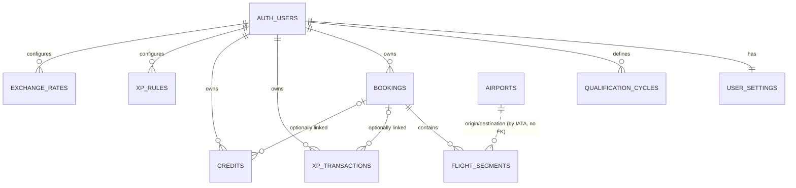

# Architecture & data model

This document is the design proposal the implementation follows. It covers the
schema, entity relationships, routes, which values are stored versus derived,
how expected/actual XP avoid double counting, and how qualification cycles work.

## 1. Layers

```
src/
  app/            Static pages (App Router, `output: 'export'`); each renders a client screen
  components/     React UI (screens, forms, dashboard widgets, navigation)
  domain/         Pure TypeScript business logic: XP buckets, costs, periods,
                  XP calculator, calendar, Excel import, CSV. No React, no Supabase. Unit tested.
  lib/store/      Reads and writes from the browser (Supabase client, RLS applies)
  lib/            Supabase client with runtime connection settings, validation, formatting
supabase/
  migrations/     The only way the database schema changes
```

Rules of thumb:

- **All Flying Blue business rules live in `src/domain` or in the database**
  (`xp_rules`). UI components only render what the domain layer returns.
- The app is a **static site** (GitHub Pages). There is no application server: the
  browser talks to Supabase directly and Row Level Security is the security boundary.
- `TrackerProvider` loads the signed-in user's data once; screens compute from it and
  every successful change reloads it. (A personal tracker holds a few thousand rows.)
- Writes live in `src/lib/store/*`, validated with Zod before they are sent.
- The Supabase URL and publishable key are entered on the Connect screen and kept in
  the browser (`localStorage`), so the public build contains no connection details.
- Dates are stored and compared as ISO `YYYY-MM-DD` strings — no timezone math.

## 2. Schema

All user-owned tables have `user_id uuid not null default auth.uid()` referencing
`auth.users`, `created_at`, `updated_at` (trigger-maintained) and — where records
can be removed from the UI — `archived_at` for soft delete.

Enumerations are `text` columns with `CHECK` constraints (easy to extend in a
migration, friendly to CSV import).

| Table | Purpose | Notes |
|---|---|---|
| `user_settings` | One row per user | preferred currency, home airport, default airline/cabin/category, current status, default XP target, theme |
| `qualification_cycles` | User-defined FB qualification periods | `start_date`..`end_date` inclusive; **exclusion constraint prevents overlapping cycles** |
| `bookings` | A ticket / travel purchase | price stored **once** here; `unique (id, user_id)` for composite FKs |
| `flight_segments` | One row per flight | FK `(booking_id, user_id)` → bookings; `position` orders segments inside a booking |
| `xp_transactions` | Non-flight XP (SAF, cards, promos, …) | optional FK to booking |
| `credits` | Money received back | `include_in_net_cost` decides if it reduces net cost |
| `airports` | Reference data (≈7k airports with IATA code) | global, read-only for authenticated users |
| `xp_rules` | Configurable XP chart | per user, seeded with the Flying Blue chart; editable |
| `exchange_rates` | Optional FX rates to the reporting currency | per user; empty is fine |
| `signup_allowlist` | Emails allowed to register | no client access (RLS on, no policies) |

Additions beyond the brief, and why:

- `archived_at` — soft delete / restore.
- `flight_segments.position` — stable order for same-day segments (AMS→CPH→ARN).
- `xp_rules.is_domestic`, `min_distance_miles`, `max_distance_miles` — the
  distance band of a `route_category` is data, not code.
- `user_settings.xp_target` — target used for the calendar-year view and as the
  default for new cycles.
- `exchange_rates` — so non-EUR amounts are never silently summed as EUR.

### Entity relationships



Segments reference airports by IATA code without a foreign key, so a missing
airport in the reference data never blocks logging a flight. The code format is
validated (`^[A-Z]{3}$`, origin ≠ destination).

Composite foreign keys `(booking_id, user_id) → bookings(id, user_id)` make it
impossible to attach a segment, XP transaction or credit to another user's booking,
independently of RLS.

## 3. Routes

Static hosting has no dynamic routes, so single records are addressed with `?id=`.

| Route | Content |
|---|---|
| `/connect` | Supabase URL + publishable key (stored in this browser) |
| `/login` | Email + password sign-in / registration (allowlist enforced in DB) |
| `/auth/confirm` | Email confirmation landing page |
| `/dashboard?period=year:2027` or `?period=cycle:<id>` | KPIs, booked vs actual, source breakdown, monthly table + cumulative chart |
| `/calendar?month=2027-01` | Monthly travel calendar, tap a day for details |
| `/history?tab=flights` | All records with filters + search, archived toggle |
| `/add/booking` | Booking + segments in one screen (origin chaining); `?itinerary=` from the calculator |
| `/add/flight?booking=<id>` | Add segment(s) to an existing booking |
| `/add/xp`, `/add/credit` | Quick XP transaction / credit entry |
| `/booking?id=` | Booking detail/edit, segments, linked XP & credits, duplicate/cancel/archive |
| `/flight?id=`, `/xp?id=`, `/credit?id=` | Edit a single record |
| `/calculator` | XP calculator, "Save as booking" |
| `/settings` | Preferences, cycles, XP rules, exchange rates, Excel import, backup/CSV export |

Mobile: bottom navigation (Dashboard, Calendar, **+**, History, Settings).
Desktop: sidebar plus a floating **+** button. Both open the same quick-add menu.

## 4. Stored versus derived

| Stored | Derived (never stored) |
|---|---|
| booking `total_price`, `baseline_alternative_price`, currency | `incremental_cost = max(total_price − baseline, 0)` |
| segment `expected_xp`, `actual_xp`, `segment_status` | which XP bucket (actual / booked) the segment counts in |
| transaction/credit amounts in **original currency** | amounts in reporting currency (via `exchange_rates`) |
| cycle `start_date`, `end_date`, `target_xp` | which cycle a record belongs to |
| — | all dashboard totals, cost per XP, monthly and cumulative series |
| `xp_rules` | calculator estimate (distance, route category, XP) |

## 5. Expected versus actual XP (no double counting)

Every XP-bearing item (a flight segment or an XP transaction) contributes to
**exactly one** bucket:

```
if item is cancelled (or its booking is cancelled)  → nothing
else if actual_xp is not null                       → ACTUAL   += actual_xp
else if status is Planned/Booked (segment)
     or Planned/Pending (transaction)               → BOOKED   += expected_xp
else (Flown / Credited but actual not entered)      → BOOKED   += expected_xp  (pending credit)

Projected = ACTUAL + BOOKED
```

Because the branches are exclusive, entering `actual_xp` *moves* the item from
booked to actual; it can never be added twice. The "Mark flown" quick action sets
`status = Flown` and pre-fills `actual_xp` with `expected_xp` (editable).

## 6. Costs

- **Airfare** is summed per *booking*, never per segment, so a six-segment ticket
  counts its price once.
- Items with status `Planned` are not yet paid and are excluded from spending
  (they appear in *planned spending*). Cancelled items keep their cost — you paid
  it — and the refund is recorded as a credit.
- A booking's cost is attributed to the date of its first non-cancelled segment
  (fallback: purchase date), so cost lands in the same cycle as its XP.
- Credits linked to a booking follow the booking's date; unlinked credits use
  their own date. Only credits with `include_in_net_cost = true` reduce cost.

```
Gross spending      = airfare + SAF + card fees + other XP costs
Net cash spending   = gross − credits(include_in_net_cost)
Cost per XP         = net cash spending / actual XP            (null when XP = 0)
Incremental airfare = Σ max(total_price − linked credits − baseline, 0) per booking
Incremental XP cost = incremental airfare + non-flight XP costs − unlinked credits (≥ 0)
Incremental €/XP    = incremental XP cost / actual XP
```

Amounts not in the reporting currency are converted with the most recent
`exchange_rates` row on or before the transaction date. If no rate exists the
amount is **excluded and reported** in a warning, never assumed to be EUR.

## 7. Qualification cycles

- A cycle is a closed date range `[start_date, end_date]` with a target.
- The database enforces non-overlapping cycles per user
  (`EXCLUDE USING gist (user_id WITH =, daterange(start_date, end_date, '[]') WITH &&)`),
  so every date belongs to at most one cycle.
- Membership is **computed from dates at query time**; nothing is stamped on the
  transactions. Creating, editing or deleting a cycle therefore never rewrites
  historical data, and old cycles keep their totals.
- The dashboard period is either a calendar year (`Jan 1 – Dec 31`) or a cycle.
  Both use the same `isDateInPeriod(date, period)` filter, so cycles crossing two
  calendar years work naturally.
- XP rollover: `qualification_cycles.carried_over_xp` holds the surplus carried
  into a cycle. It counts towards that cycle's totals only, never towards calendar
  years (so it is not modelled as an XP transaction).

## 8. XP calculator

1. Look up both airports' coordinates.
2. Great-circle distance in miles (haversine).
3. Domestic if both airports share a country code.
4. Pick the active rule for the flight date and cabin: a domestic rule when the
   flight is domestic, otherwise the rule whose `[min, max)` distance band
   contains the distance.
5. Return distance, route category and XP. The result is an *estimate*: it
   pre-fills `expected_xp`, which can always be overridden; credited XP is stored
   separately in `actual_xp`.

## 9. Security

- RLS on every table. Policies: `select/insert/update/delete` where
  `auth.uid() = user_id`, granted to `authenticated` only.
- `airports` is readable by authenticated users; nobody can write via the API.
- Registration is restricted by a `before insert` trigger on `auth.users` that
  rejects emails not present in `signup_allowlist`.
- The browser only ever sees the publishable/anon key. No service-role key is
  used by the app, and no key is compiled into the public build.
- Signed-out users are sent to `/login` by a client-side gate; this is only
  navigation — data access is enforced by RLS in the database.

## 10. Offline / PWA

The app ships a manifest, icons and a small service worker (static asset cache,
offline fallback page). All writes go through `src/lib/store/*`; offline entry can
later be added by queueing those calls in IndexedDB and replaying them.

## 11. Excel import (Earning Log)

`src/domain/earning-log.ts` turns the original tracker's Earning Log rows into
bookings, segments and XP transactions:

- A flight row with a price starts a booking; price-0 rows join the open booking whose
  last destination is their origin (returns and connections stay on one ticket).
- SAF columns on a flight row → SAF transaction linked to that booking; card rows →
  Credit Card XP (fee = cost); "Accor ALL"-style rows → Partner XP.
- Rows dated up to today are credited (actual XP), later rows are booked.
- Ids are derived from row content, so re-importing updates instead of duplicating.
- Qualification cycles are rebuilt from credited XP: a cycle lasts 12 months; reaching
  the next level ends it at the end of that month, the next starts on the 1st with the
  surplus as `carried_over_xp`.
